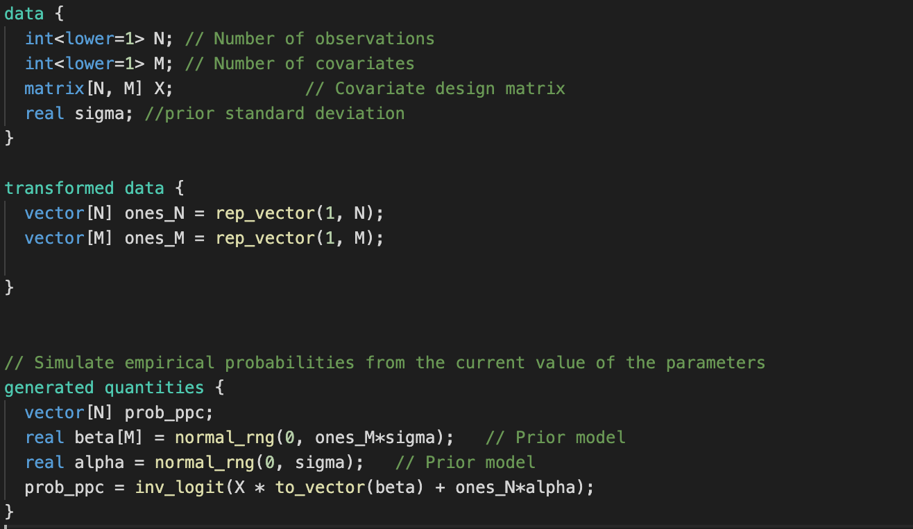
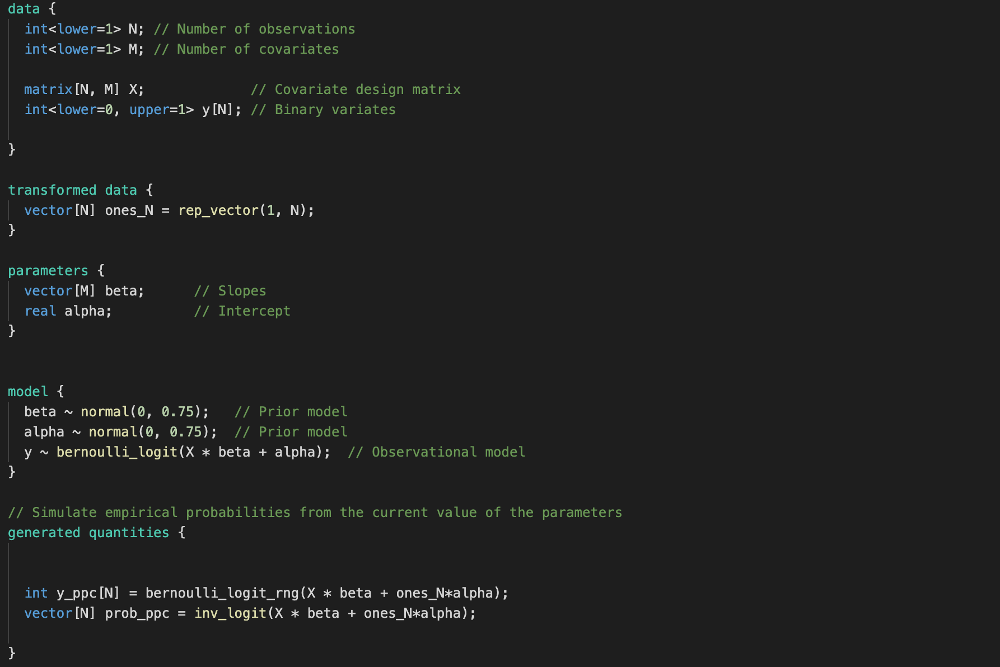

# Lab 5 - General Linear models


## Excercise - logistic regression


Tasks for whole exercise are specified in the labolatory notebook. Here you can find code for stan models:

```logistic_regression_ppc.stan```


<hr>


```logistic_regression.stan```


<hr>

