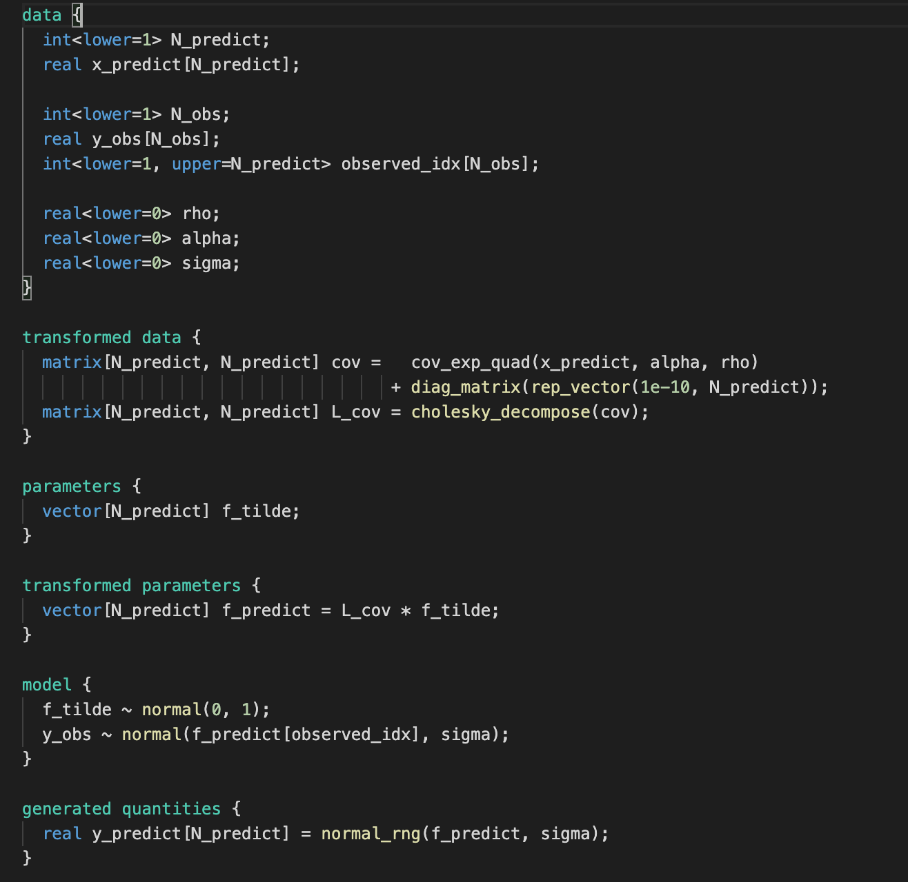
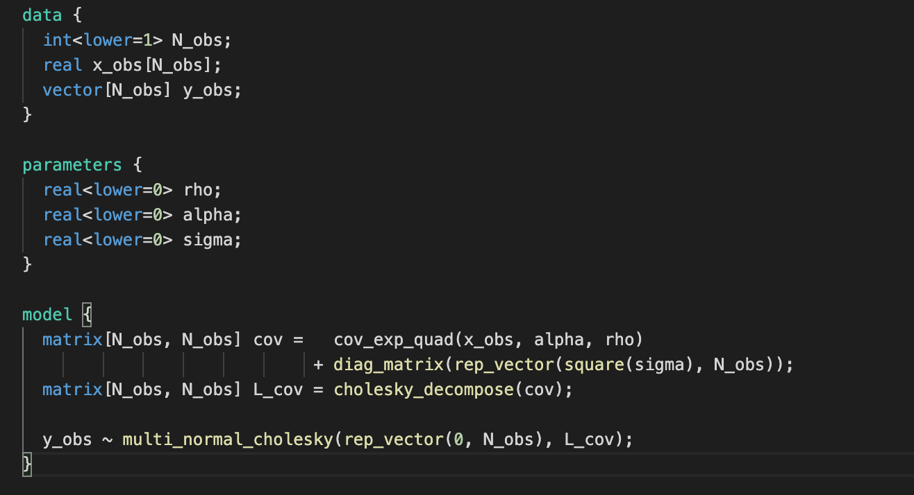

# Lab 6 - Gaussian Process


## Excercise - Gaussian Process regression


Tasks for whole exercise are specified in the labolatory notebook. Here you can find code for stan models:

```gaussian_process.stan```


<hr>


```gaussian_process_optimize.stan```


<hr>

