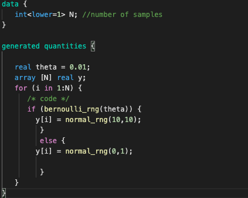
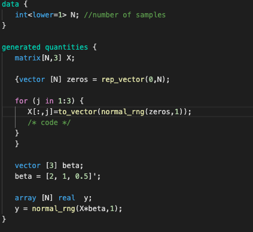
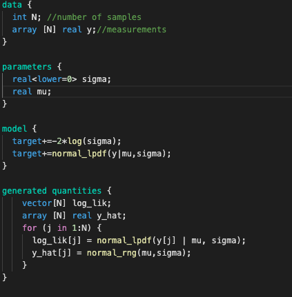
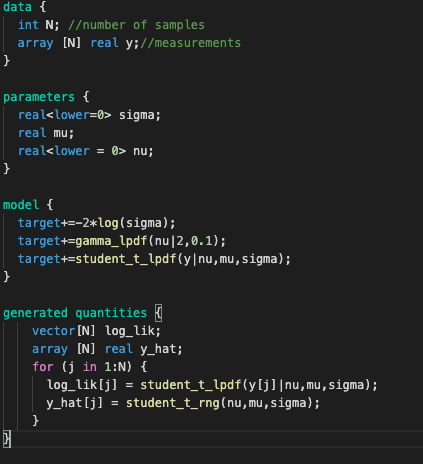
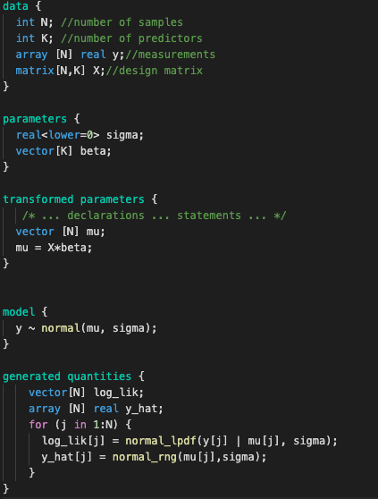

# Lab 7 -  Model comparison
F - number of letters in first name
L - number of letters in last name
N = (L+F)*100

## Excercise 1 - generate data
```code_1.stan```



```code_2.stan```




1. Compile code_1.stan and  code_2.stan 
2. Generate data for rest of excercises.

## Excercise 2 - compare normal and student models for data from first file
```code_3.stan```



```code_4.stan```



1. Compile both models
2. Fit both models
3. Using az.compare and az.plot_compare analyze both models using ```loo``` and ```waic``` criteria. 

### Excercise 3 - compare models with different numbers of predictors
```code_5.stan```



1. Compile model
2. Compare models for 1, 2 and 3 predictors as in previous excercise
